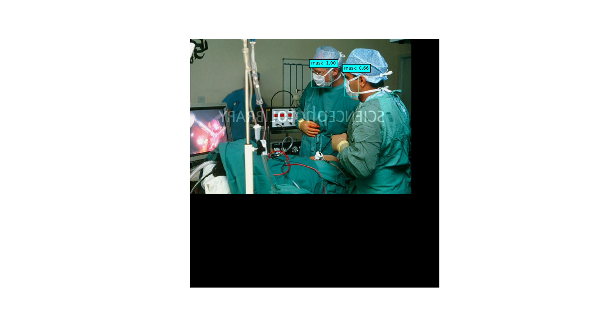
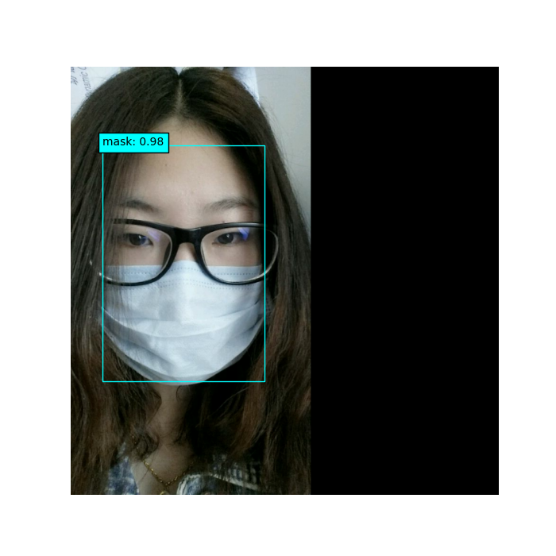

# Face-Mask-Detection-with-RetinaNet

- 本项目代码主要基于`keras`官网的[Object Detection with RetinaNet](https://keras.io/examples/vision/retinanet/)的实现
- 采用了类似于`pytorch`的数据生成器(dataloader)，载入标签数据(`image`,`bounding boxes`)，编码锚框(`encoding anchor boxes`),统一了data pipeline api，极大地简化了代码，同时也引入了不少bugs(基于`tensorflow==2.3`)
- 本项目代码仅为`RetinaNet`的简单实现，代码尽可能地保持简洁，未经优化、完备。有关原理可以参考该项目下的演示ppt`基于RetinaNet的人脸口罩检测.pptx`.
- 预测结果
       
